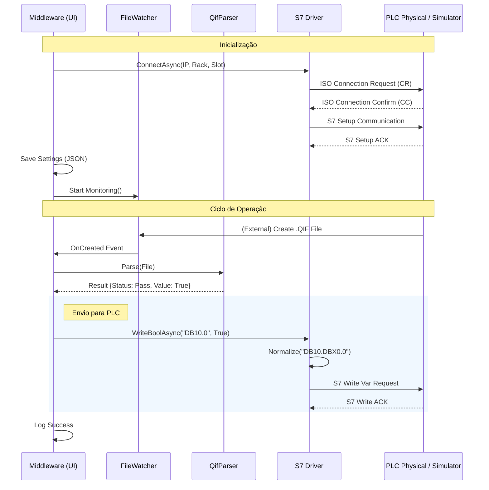

# ConnectML Architecture Documentation

## 1. Visão Geral do Projeto
**ConnectML** é um middleware de integração projetado para atuar como uma ponte entre o software de metrologia **MeasurLink** (Mitutoyo) e controladores lógicos programáveis (**PLCs Siemens S7**).

O sistema monitora arquivos de saída QIF (Quality Information Framework), extrai resultados de medição e envia sinais de controle (Aprovado/Reprovado ou Contadores) para o PLC em tempo real.

### Stack Tecnológica
- **Plataforma**: .NET 8 (LTS)
- **UI Framework**: WPF (Windows Presentation Foundation)
- **Driver PLC**: [S7NetPlus](https://github.com/S7NetPlus/s7netplus) (Driver S7 Nativo em C#)
- **Logging**: Serilog (Sinks para Arquivo e UI)
- **Configuração**: JSON (`System.Text.Json`)

---

## 2. Estrutura da Solução

A solução segue uma arquitetura em camadas simplificada para garantir manutenibilidade e separação de responsabilidades.

| Projeto | Camada | Descrição |
| :--- | :--- | :--- |
| **`ConnectML.UI`** | Apresentação | Interface gráfica (WPF), Gerenciamento de Estado (MVVM simplificado), Injeção de Dependências e Persistência de Configurações. Responsável por instanciar os serviços. |
| **`ConnectML.Core`** | Domínio | Contém as Interfaces principais (`IPlcDriver`), Logicações de Negócio puras e Parsers (`QifParser`). Não possui dependências de infraestrutura. |
| **`ConnectML.Infrastructure`** | Infraestrutura | Implementações concretas das interfaces do Core. Aqui reside o **`SiemensS7Driver`** (comunicação TCP/IP) e **`FileWatcherService`**. |
| **`ConnectML.Simulator`** | QA / Ferramentas | Aplicação Console isolada que simula um PLC Siemens S7. Abre um Socket na porta 102 para validar o `Handshake` e receber comandos de escrita. |

---

## 3. Fluxo de Dados (Data Flow)

O ciclo de vida da informação no ConnectML segue 5 etapas principais:

1.  **Monitoramento**: O `FileWatcherService` detecta a criação de um novo arquivo `.QIF` na pasta configurada.
2.  **Extração (Parsing)**: O `QifParser` lê o XML, identifica a última medição e determina o status (`PASS` ou `FAIL`).
3.  **Lógica de Negócio**: Com base no modo selecionado (`Booleano` ou `Inteiro`), o sistema decide qual valor escrever.
4.  **Comunicação (Driver S7)**:
    - O `SiemensS7Driver` normaliza o endereço (ex: `DB10.0` -> `DB10.DBX0.0`).
    - Envia o pacote via TCP/IP (ISO-on-TCP).
    - Aguarda o ACK do PLC.
5.  **Feedback**: O resultado é registrado nos Logs visuais da UI e salvo em arquivo.

### Diagrama de Sequência

---

## 4. Guia de Configuração e Uso

### Persistência de Dados
As configurações são salvas automaticamente no arquivo `appsettings.json` na raiz da aplicação.
- **Save Trigger**: Ao clicar em "Iniciar Serviço".
- **Load Trigger**: Ao abrir a aplicação.

### Configuração do Driver S7
- **Endereço IP**: IP do PLC (ex: `192.168.0.1`). Para testes locais, use `127.0.0.1`.
- **Rack / Slot**: Padrão Siemens S7-1500/1200 é Rack `0`, Slot `1`. Para S7-300 geralmente é Rack `0`, Slot `2`.
- **Endereços DB**:
  - **Booleano**: Formato `DBn.x` (ex: `DB10.0`). O sistema converte automaticamente para `DB10.DBX0.0`.
  - **Inteiro**: Formato `DBn.x` (ex: `DB10.2`). O sistema converte para `DB10.DBW2`.

### Utilizando o ConnectML.Simulator
Para validar a comunicação sem hardware físico:
1.  Abra o terminal como **Administrador**.
2.  Navegue até `ConnectML.Simulator`.
3.  Execute: `dotnet run`.
4.  Na UI do ConnectML, configure o IP para `127.0.0.1`.
5.  Inicie o serviço. O Simulator responderá aos handshakes e exibirá os dados recebidos.

---

## 5. Decisões Técnicas Importantes

### Por que S7NetPlus?
Optamos pelo **S7NetPlus** por ser uma biblioteca Open Source madura, nativa em C# (sem dependências de DLLs C++ não gerenciadas como LibNodave) e com bom suporte aos protocolos modernos S7Comm usados nos PLCs S7-1200/1500.

### Normalização de Endereços
Para melhorar a UX, implementamos uma camada de normalização no `SiemensS7Driver.cs`. O usuário final (operador) muitas vezes conhece o endereço apenas como "DB10.0". O driver intercepta isso e expande para a notação técnica que o protocolo exige (`DB10.DBX0.0` para bits, `DB10.DBW0` para palavras), prevenindo o erro `ArgumentOutOfRangeException` que ocorreria nativamente na biblioteca.

### Estratégia de "Hex Dump" no Simulador
Em vez de implementar a stack S7 completa (que é proprietária e complexa), o simulador implementa apenas o **Handshake** (COTP CR/CC + S7 Setup) necessário para enganar o driver e faz um "Hex Dump" do payload de escrita. Isso é suficiente para validar que:
1.  A rede está acessível.
2.  O driver conectou.
3.  O driver enviou bytes de escrita.
