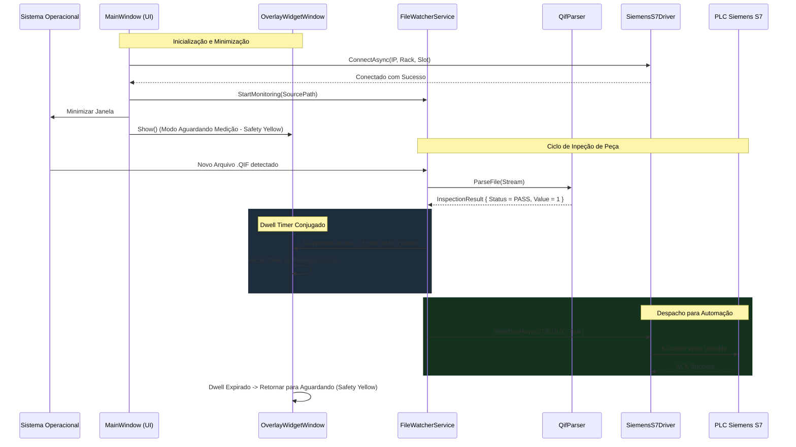

# ConnectML Architecture Documentation (Versão 1.3.1)

## 1. Visão Geral do Projeto
**ConnectML** é um middleware de integração industrial desenvolvido para conectar os softwares de metrologia (notavelmente o **MeasurLink / Mitutoyo**) aos sistemas de automação de manufatura (**CLPs Siemens S7**, barramentos industriais e endpoints **Webhook REST**).

O sistema monitora diretórios locais ou de rede em busca de arquivos de exportação **QIF (Quality Information Framework)** em tempo real, analisa as características geométricas e dimensionais inspecionadas, extrai o veredito da peça (`PASS` ou `FAIL`) e despacha comandos de controle aos PLCs ou sistemas MES/SCADA.

A partir da versão **1.3.0**, o ConnectML incorpora o subsistema **Widget Overlay HUD (Heads-Up Display)**, e a partir da versão **1.3.1**, introduz o subsistema de **Monitoramento e Transporte Serial do Leitor de Código de Barras**, atuando como uma ponte de comunicação com intercepção de palavras-chave e simulação de atalhos físicos de teclado no MeasurLink (como `Alt + F + O` para desfazer medição).

---

### Stack Tecnológica
- **Linguagem & Runtime**: C# 12 / .NET 8 (LTS)
- **Apresentação (UI)**: WPF (Windows Presentation Foundation) com Design System Dark Industrial
- **Integração Win32**: P/Invoke para estilos de janela transparentes não intrusivos (`WS_EX_NOACTIVATE`, `WS_EX_TOOLWINDOW`)
- **Comunicação Industrial**: [S7NetPlus](https://github.com/S7NetPlus/s7netplus) (comunicação nativa ISO-on-TCP para Siemens S7-300/1200/1500)
- **Comunicação Web**: `HttpClient` assíncrono resiliente com suporte a templates JSON Fluid/Liquid
- **Logging Estruturado**: Serilog (Sinks paralelos para Arquivo rotativo e terminal visual WPF via `AvalonEdit`)
- **Distribuição e Atualização Automática**: [Velopack](https://velopack.io/) integrado nativamente com suporte a pacotes delta e GitHub Releases

---

## 2. Estrutura da Solução

A solução adota uma arquitetura modular em camadas limpas, garantindo isolamento entre domínio, infraestrutura e apresentação:

```
c:\Antigravity\ConnectML
├── ConnectML.Core/            # Domínio puro e contratos (agnóstico de infraestrutura)
├── ConnectML.Infrastructure/  # Drivers S7, Webhooks, Leitura QIF e Logging
├── ConnectML.UI/              # Aplicação Desktop WPF, HUD Overlay e Configurações
└── ConnectML.Simulator/       # Emulador local de PLC Siemens para desenvolvimento e QA
```

| Projeto | Camada | Responsabilidades Principais |
| :--- | :--- | :--- |
| **`ConnectML.UI`** | Apresentação | Janela Principal (`MainWindow`), Janela do HUD (`OverlayWidgetWindow`), Janela de Configurações do HUD (`OverlaySettingsWindow`), Gerenciamento de Ciclo de Vida da Bandeja (Tray Icon), `VelopackApp` e Persistência em `%LocalAppData%`. |
| **`ConnectML.Core`** | Domínio | Interfaces de abstração (`IPlcDriver`), modelos de configuração (`AppConfig`, `OverlayPosition`), modelos de metrologia (`InspectionResult`) e parsing XML agnóstico (`QifParser`). |
| **`ConnectML.Infrastructure`** | Infraestrutura | `SiemensS7Driver` (normalização de DBs e pacotes S7Comm), `FileWatcherService` (monitoramento reativo de I/O em disco), clientes HTTP para Webhook e sinks de log. |
| **`ConnectML.Simulator`** | QA / Ferramentas | Servidor console Socket TCP na porta 102 que emula o handshake COTP/S7 e exibe hex dump dos dados recebidos para testes offline. |

---

## 3. Subsistema Widget Overlay HUD Industrial (v1.3.0)

O subsistema HUD foi desenvolvido para atender à demanda de chão de fábrica onde o operador utiliza a máquina com softwares de medição ou CNC em tela cheia e necessita saber, sem tocar no computador, o status da comunicação e o resultado da última peça inspecionada.

```
+-------------------------------------------------------------------------+
| [Borda Superior com Alça de Redimensionamento SizeNS]                  |
|                                                                         |
|                                                                         |
|   +---------------------------------------------------------------+     |
|   |  [⋮⋮ Drag]  (• Pulso) AGUARDANDO MEDIÇÃO  [⚙ Config] [🗖 Rest] |     |  <-- Aba de Status
|   +---------------------------------------------------------------+     |      (4-Edge Snap)
|                                                                         |
|                                                                         |
| [Borda Inferior com Alça de Redimensionamento SizeNS]                  |
+-------------------------------------------------------------------------+
```

### 3.1. Não-Intrusividade e Interop Win32
O HUD sobrepõe toda a área de trabalho sem interromper a rotina de trabalho:
- **`WS_EX_NOACTIVATE (0x08000000)`**: Aplicado via `SetWindowLong` no evento `SourceInitialized`. Impede que o clique na aba do HUD roube o foco da janela ativa (ex: MeasurLink ou editor de texto do operador).
- **`WS_EX_TOOLWINDOW (0x00000080)`**: Remove o HUD da listagem do alternador de janelas `Alt+Tab`.
- **Hit Testing Seletivo**: O contêiner principal do HUD opera com `Background="Transparent"` e áreas desprovidas de controles possuem `IsHitTestVisible="False"`. Cliques nessas regiões passam integralmente para o software rodando abaixo.

### 3.2. Snapping Magnético em 4 Bordas e Rotação Vertical
O usuário pode posicionar a aba de status onde for mais conveniente usando a alça de arraste (`⋮⋮`):
- **Bordas Disponíveis**: `TOP`, `BOTTOM`, `LEFT` e `RIGHT`, limitadas estritamente à `SystemParameters.WorkArea` (respeitando barras de tarefas e monitores secundários).
- **Adaptação Lateral**: Ao ser acoplado à esquerda ou à direita, o contêiner aplica uma `LayoutTransform` com `RotateTransform Angle="90"`. A hierarquia interna inverte sua ordem para que a leitura dos textos e ícones ocorra ergonomicamente de baixo para cima.

### 3.3. Janela de Configurações Desacoplada (`OverlaySettingsWindow`)
Todas as preferências do HUD foram retiradas da tela principal e concentradas em uma janela modal dedicada:
- Acionada pelo ícone de engrenagem (⚙️) na aba.
- Permite regular a espessura da borda, tamanho da aba/fonte e alternar a posição de docking.
- As alterações são refletidas em tempo real na interface do HUD através de bindings e eventos imediatos.

### 3.4. Redimensionamento Direto por Mouse Drag
O operador pode redimensionar visualmente os elementos sem abrir o menu de configurações:
- **Borda Principal**: Quatro faixas invisíveis nas extremidades da tela (`BorderTopGrip`, `BorderBottomGrip`, `BorderLeftGrip`, `BorderRightGrip`) capturam o cursor (`SizeNS` ou `SizeWE`) e recalculam dinamicamente a propriedade `BorderThickness`.
- **Aba de Status**: O grip do canto (`TabResizeGrip`) e a faixa longitudinal externa (`TabEdgeResizeStrip`) ajustam a altura/largura da aba e a escala da tipografia com preservação de proporção.
- **Faixas Operacionais**:
  - Espessura de Borda: de `1 px` até `60 px`.
  - Tipografia/Aba: de `11 pt` até `60 pt` (leitura nítida a mais de 5 metros de distância).

### 3.5. Estados Visuais, Safety Yellow e Dwell Timer Conjugado
O HUD transiciona por três estados operacionais:
1. **Aguardando Medição (Prontidão)**: Borda externa, contorno da aba e ponto de pulso em **Safety Yellow** (`#FFCC00`), com animação rápida de Storyboard (0.5s / 1 Hz).
2. **Peça Aprovada (PASS)**: Borda e aba em **Verde Industrial** (`#2ECC71`), com texto em destaque e indicação sonora/visual.
3. **Peça Reprovada (FAIL)**: Borda e aba em **Vermelho Alerta** (`#E74C3C`), alertando imediatamente o operador da não-conformidade.
- **Dwell Timer (0.5s)**: Quando um veredito é processado pelo `FileWatcherService`, o HUD congela o resultado pelo intervalo de 0.5s antes de retomar automaticamente a animação amarela de prontidão para a próxima peça.

### 3.6. Ciclo de Vida Integrado
- **Minimização Mandatória**: Sempre que a janela principal é minimizada ou fechada para a bandeja (`HideToTray`), o HUD é instanciado e exibido automaticamente. Não há chave para desativá-lo, garantindo a supervisão contínua da linha.
- **Restauração Rápida**: Clicar no botão de restaurar (🗖) ou dar duplo-clique no ícone da bandeja oculta o HUD e traz a janela principal ao primeiro plano.

---

## 4. Fluxo de Dados e Ciclo de Vida do Middleware


```mermaid
sequenceDiagram
    participant OS as Sistema Operacional
    participant UI as MainWindow (UI)
    participant HUD as OverlayWidgetWindow
    participant FW as FileWatcherService
    participant Parser as QifParser
    participant S7 as SiemensS7Driver
    participant PLC as PLC Siemens S7

    Note over UI, HUD: Inicialização e Minimização
    UI->>S7: ConnectAsync(IP, Rack, Slot)
    S7-->>UI: Conectado com Sucesso
    UI->>FW: StartMonitoring(SourcePath)
    UI->>OS: Minimizar Janela
    UI->>HUD: Show() (Modo Aguardando Medição - Safety Yellow)

    Note over FW, PLC: Ciclo de Inpeção de Peça
    OS->>FW: Novo Arquivo .QIF detectado
    FW->>Parser: ParseFile(Stream)
    Parser-->>FW: InspectionResult { Status = PASS, Value = 1 }
    
    rect rgb(30, 45, 60)
        Note over HUD: Dwell Timer Conjugado
        FW->>HUD: Dispatcher.Invoke -> Exibir PASS (Verde)
        HUD->>HUD: Iniciar Timer de Retenção (0.5s)
    end

    rect rgb(20, 50, 30)
        Note over S7, PLC: Despacho para Automação
        FW->>S7: WriteBoolAsync("DB10.0", True)
        S7->>PLC: S7comm Write Variable
        PLC-->>S7: ACK Success
    end

    HUD->>HUD: Dwell Expirado -> Retornar para Aguardando (Safety Yellow)
```

---

## 5. Subsistema Leitor de Código de Barras e Automação MeasurLink (v1.3.1)

A partir da versão **1.3.1**, o ConnectML incorpora o subsistema de **Monitoramento e Transporte Serial do Leitor de Código de Barras**, atuando como uma ponte de comunicação com intercepção condicional de comandos.

```
[ Leitor de Código de Barras ]
               │
      (Porta COM Entrada)
               ▼
[ BarcodeSerialMonitorService ] ────▶ Coincide com Palavra-Chave?
               │                                   │
               │ NÃO                               │ SIM (Intercepção)
               ▼                                   ▼
 [ COM Saída (com0com) ]                [ WindowFocusHelper (Win32) ]
               │                        (Localiza e Foca "MeasurLink")
               ▼                                   │
   [ MeasurLink (Serial) ]                         ▼
                                      [ MeasurLinkKeyboardCommandHandler ]
                                      (Simula teclas físicas: ex: Alt+F+O)
```

### 5.1. Transporte Serial Transparente
- A aplicação monitora a porta serial de entrada conectada ao leitor (físico ou virtual) de forma assíncrona.
- Toda leitura ordinária de dados é transportada em tempo real para uma porta serial de saída virtual (par gerenciado pelo utilitário `com0com`), permitindo que o MeasurLink receba os dados sem latência perceptível.

### 5.2. Intercepção e Automação de Teclado no MeasurLink
- Quando a string recebida coincide com uma "palavra-chave" cadastrada pelo usuário (ex: `"DESFAZER"`), o repasse pela porta COM de saída é suprimido.
- O subsistema utiliza o helper de interop Win32 (`WindowFocusHelper`) com algoritmo de pontuação de processos:
  - Janelas pertencentes a processos legítimos do MeasurLink (`Mitutoyo.MeasurLink.WinConsole.exe`, `DataCollection.exe`) recebem pontuação máxima (+10.000 pontos).
  - Janelas do Windows Explorer (`explorer.exe`) ou consoles com nomes coincidentes de diretórios são desqualificadas para evitar falsos positivos.
  - A janela selecionada é restaurada se estiver minimizada (`ShowWindow SW_RESTORE`) e colocada em primeiro plano via concessão de privilégios (`AttachThreadInput` + `SetForegroundWindow`).
- Em seguida, o `MeasurLinkKeyboardCommandHandler` aguarda o tempo de estabilização pós-foco (`PreDelayMs`, padrão 150ms) e despacha a sequência de teclas configurada (ex: `Alt + F + O` para o comando **Desfazer**):
  - Injeta os códigos de varredura de hardware OEM (`MapVirtualKey` com `KEYEVENTF_SCANCODE`).
  - Implementa cadência estrita de mnemônicos do Windows: pressiona `Alt`, envia a tecla do menu (`F`), libera `Alt`, aguarda 180ms para abertura do submenu e envia a tecla da ação (`O`).

### 5.3. Extensibilidade via Configuração JSON & Acesso Rápido na UI
- Os comandos não estão engessados no código-fonte. A lista `BarcodeCommands` no `AppConfig` permite que usuários avançados e integradores adicionem novos comandos no arquivo de configurações `%AppData%\ConnectML\appsettings.json`, especificando nome, sequência de teclas e título da janela-alvo.
- **Botão de Atalho Direto (`BtnOpenConfigJson`)**: Posicionado ao lado do botão `+` na seção Utilidades, permite abrir o `appsettings.json` ativo com apenas um clique no editor de texto padrão do Windows.
- **Recarregamento Dinâmico (Hot Reload)**: A aplicação recarrega automaticamente os comandos do disco sempre que o serviço é iniciado, parado, o switch do leitor é alternado, uma nova regra é criada ou quando a janela do ConnectML recupera o foco (`Window.Activated`).

### 5.4. Não-Bloqueio e Concorrência Estrita
- Toda a leitura serial e execução de atalhos operam em tarefas assíncronas dedicadas em background (`Task.Run`), garantindo zero interferência na esteira principal de arquivos QIF e na comunicação com PLCs Siemens S7 e Webhooks REST.

---

## 6. Subsistema de Atualização Automática (Velopack)

O ConnectML utiliza o framework **Velopack** para atualizações transparentes:
- **Armazenamento Seguro de Configurações**: As preferências do operador residem em `%LocalAppData%\ConnectML\user_settings.json`, isoladas dos diretórios de binários (`app-*`), garantindo que nenhuma configuração seja perdida durante os updates.
- **Pacotes Diferenciais (Delta)**: O compilador `vpk pack` compara a versão atual com a anterior e gera pacotes delta ultraleves (ex: v1.3.0 -> v1.3.1 gerou um delta de apenas 311 KB contra 86 MB do pacote completo).
- **Ciclo de Atualização em Segundo Plano**:
  1. A aplicação checa periodicamente a URL de releases no GitHub via `VelopackUpdateService`.
  2. Ao detectar nova versão, baixa os pacotes silenciosamente em segundo plano.
  3. Altera o ícone de status no rodapé para um aviso de atualização pendente.
  4. Aplica a nova versão ao reiniciar a aplicação ou por acionamento do usuário.

---

## 7. Decisões Técnicas Importantes

1. **Janelas WPF Transparentes sem Foco (`WS_EX_NOACTIVATE`)**:
   - Em WPF padrão, janelas com `WindowStyle="None"` e `AllowsTransparency="True"` ainda recebem ativação do Windows ao serem clicadas. A injeção das flags Win32 via P/Invoke foi essencial para garantir a ergonomia do operador em máquinas de medir tridimensionais (CMM).
2. **Normalização de Endereçamento Siemens**:
   - Para evitar exceções de formato (`ArgumentOutOfRangeException`), o driver converte representações simples como `DB10.0` em notações completas do protocolo (`DB10.DBX0.0`).
3. **Encoding Latin1 / ISO-8859-1 para Arquivos QIF**:
   - Softwares de metrologia frequentemente exportam símbolos de grau (`°`), diâmetro (`Ø`) e acentuação padrão ANSI. O parser utiliza estritamente `Encoding.Latin1` para evitar corrupção de caracteres.
