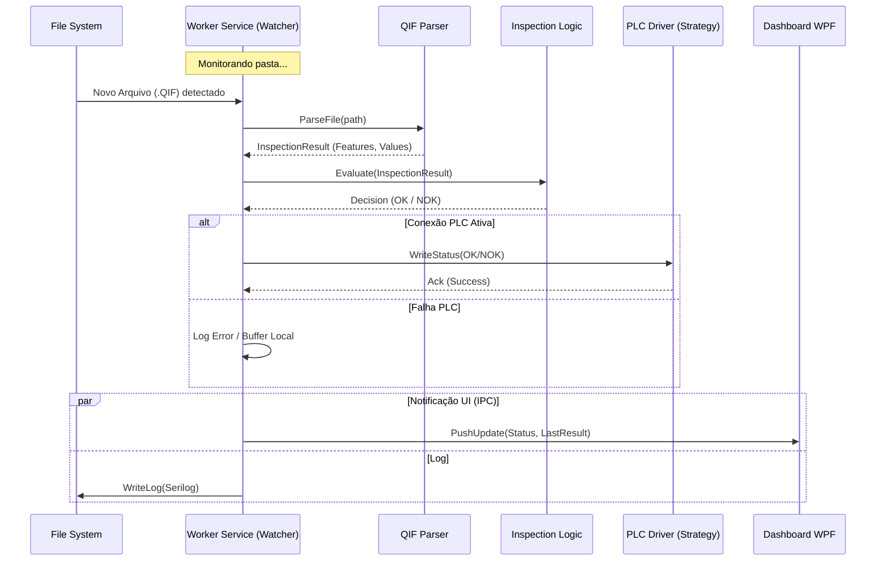

# Arquitetura do Projeto ConnectML

## 1. Visão Geral

O **ConnectML (MeasurLink Connector)** é um middleware industrial projetado para integrar dados de qualidade (arquivos QIF/XML do MeasurLink) com sistemas de automação (CLPs). A arquitetura proposta visa alta disponibilidade, modularidade para múltiplos protocolos industriais e desacoplamento entre o processamento em background e a interface de usuário.

### Objetivos Técnicos
*   **Robustez:** Operar 24/7 como um Windows Service.
*   **Extensibilidade:** Suportar novos protocolos (Siemens, Modbus, MQTT) sem alterar o núcleo.
*   **Desacoplamento:** A interface (WPF) consome dados do serviço, mas não o processa.

---

## 2. Estrutura da Solução

A solução segue os princípios da **Clean Architecture** e **DDD (Domain-Driven Design)** simplificado, dividida em projetos com responsabilidades bem definidas.

### Projetos Sugeridos

#### `ConnectML.Core` (Class Library)
O núcleo da aplicação. Não depende de nenhuma biblioteca externa (exceto talvez primitivos padrão).
*   **Entidades:** `InspectionResult`, `MeasuredFeature`, `PlcConfig`.
*   **Interfaces (Portas):**
    *   `IPlcDriver`: Contrato para comunicação com CLPs.
    *   `IFileParser`: Contrato para interpretar arquivos (QIF, XML).
    *   `IInspectionLogic`: Regras de negócio (ex: O que define um NOK?).
*   **Exceções de Domínio:** `PlcConnectionException`, `InvalidQifFormatException`.

#### `ConnectML.Infrastructure` (Class Library)
Implementação das interfaces do Core. É onde as dependências externas residem.
*   **Drivers:** `SiemensPlcDriver` (via S7NetPlus), `ModbusPlcDriver` (via NModbus), `OpcUaDriver`.
*   **Parsers:** `QifXmlParser` (via `System.Xml.Linq`).
*   **IO:** `DirectoryWatcherService` (Monitoramento de arquivos).
*   **Logging:** Implementação do `Serilog`.

#### `ConnectML.Service` (Worker Service) **[Novo]**
O "motor" da aplicação. Um Windows Service (.NET Worker) que hospeda a lógica.
*   **Ciclo de Vida:** Gerencia o `FileSystemWatcher` e a conexão persistente com o PLC.
*   **IPC Server:** Hospeda um servidor gRPC ou NamedPipe para reportar status à UI.
*   **Injeção de Dependência:** Configura o container DI (Host Builder).

#### `ConnectML.UI` (WPF Application)
Dashboard de monitoramento e configuração.
*   **Papel:** Cliente do serviço. Não processa arquivos diretamente.
*   **Features:** Visualização de logs em tempo real, status do PLC (Online/Offline), contadores de produção.
*   **IPC Client:** Conecta-se ao `ConnectML.Service` para buscar dados.

#### `ConnectML.Shared` (Class Library)
Contratos de dados compartilhados entre o Serviço e a UI (DTOs).
*   Utilizado para definir as mensagens gRPC ou objetos serializáveis para NamedPipes.

---

## 3. Padrões de Design e Decisões Técnicas

### 3.1. Gerenciamento de Drivers PLC (Strategy & Factory Pattern)
Para suportar múltiplos protocolos (Siemens S7, Modbus, OPC UA) sem violar o **OCP (Open-Closed Principle)**, utilizaremos o padrão Strategy.

*   **Interface:** `IPlcDriver` (definida no Core).
*   **Factory:** `PlcDriverFactory` recebe a configuração (ex: "Protocol": "Siemens") e instancia a classe correta via DI.

```csharp
// Exemplo conceitual
public class PlcDriverFactory {
    public IPlcDriver Create(PlcConfig config) {
        return config.Protocol switch {
            ProtocolType.SiemensS7 => serviceProvider.GetRequiredService<SiemensPlcDriver>(),
            ProtocolType.ModbusTCP => serviceProvider.GetRequiredService<ModbusPlcDriver>(),
            _ => throw new NotImplementedException()
        };
    }
}
```

### 3.2. Fluxo de Processamento (Observer Pattern)
O monitoramento de arquivos utiliza o padrão Observer através do `FileSystemWatcher`.
1.  O `DirectoryWatcherService` dispara um evento `OnFileCreated`.
2.  O `InspectionProcessor` (Subscriber) reage, invoca o Parser e depois o PLC Driver.

### 3.3. Gerenciamento de Estado (IPC - Inter-Process Communication)
Para comunicar o Windows Service (que roda na Sessão 0) com a UI (Sessão do Usuário), recomenda-se **gRPC sobre Named Pipes** (suportado nativamente no .NET 8) ou **gRPC sobre TCP local**.

*   **Por que gRPC?** Fortemente tipado (Contratos `.proto`), alta performance e moderno.
*   **Dados Trafegados:**
    *   `GetServiceStatus()`: Retorna { State: Running, Plc: Connected, LastFile: "part123.qif" }.
    *   `StreamLogs()`: Stream contínuo de logs para o console da UI.

---

## 4. Diagrama de Sequência (Fluxo de Dados)

O diagrama abaixo ilustra o ciclo de vida de uma nova medição detectada.



## 5. Tecnologias e Bibliotecas Sugeridas

*   **Plataforma:** .NET 8 (LTS).
*   **DI:** `Microsoft.Extensions.DependencyInjection`.
*   **Comunicação PLC:**
    *   Siemens: `S7NetPlus`.
    *   Modbus: `NModbus4`.
    *   OPC UA: `OPCFoundation.NetStandard.Opc.Ua`.
*   **IPC (Service <-> UI):** `Grpc.AspNetCore` (com suporte a Named Pipes no .NET 8) ou `H.Pipes` (se preferir algo mais simples que gRPC).
*   **Parsing:** `System.Xml.Linq` (nativo e performático).
*   **UI:** WPF com `CommunityToolkit.Mvvm`.
