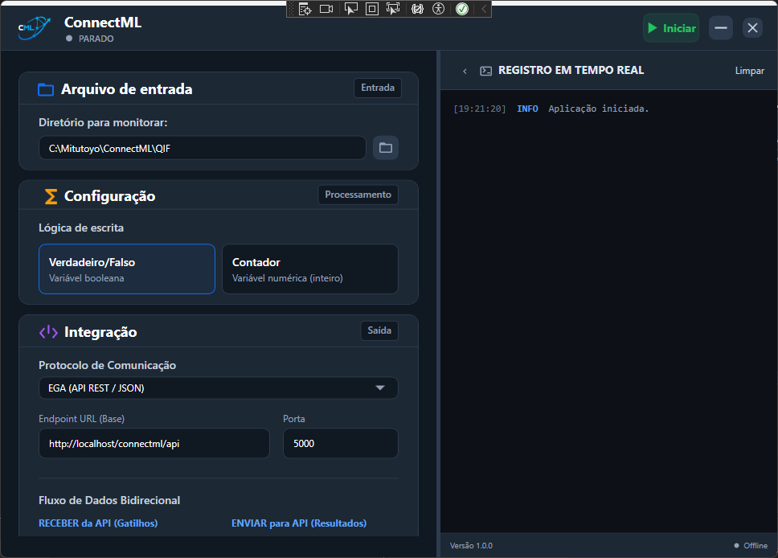

# Contexto do Projeto ConnectML

## 1. Visão Geral do Projeto (Project Overview)
O ConnectML é um middleware industrial desenvolvido especificamente para integrar os dados de qualidade e medição gerados pelo software de qualidade (como MeasurLink), que exporta no formato QIF (Quality Information Framework). A principal dor que este sistema resolve para o customer é permitir uma comunicação rápida, confiável e automatizada destes dados com equipamentos de chão de fábrica, mais especificamente PLCs Siemens S7. Essa integração garante que a linha de produção de automação saiba de forma rápida se uma peça inspecionada passou ou falhou nas medições, possibilitando rejeições e controle exato na linha.

## 2. Stack Tecnológica
A partir da análise dos arquivos da solução, a stack atual utilizada pelo ConnectML compreende:
* **.NET 8**: Framework base para toda a solução, garantindo performance e suporte moderno.
* **WPF (Windows Presentation Foundation)**: Utilizado para a interface de usuário (UI) desktop rica e responsiva (`ConnectML.UI`).
* **Serilog (e Serilog.Sinks.File)**: Sistema robusto e extensível de log, amplamente adotado em `ConnectML.UI` e `ConnectML.Infrastructure`, para observabilidade de eventos em arquivos diários.
* **S7NetPlus**: Biblioteca open-source (`v0.20.0`) na camada de infraestrutura que permite a comunicação direta com os PLCs da Siemens via protocolo nativo S7, sem necessidade de middlewares de terceiros.
* **Velopack**: Mecanismo de geração do instalador e sistema de updates dinâmicos, garantindo facilidade no deployment corporativo.

## 3. Arquitetura da Solução
A solução `ConnectML.sln` segue os princípios da separação de responsabilidades (Clean/Onion Architecture) e é construída sobre quatro pilares distintos:

* **`ConnectML.Core`**: O coração (Domínio) do projeto. Contém todos os modelos e a lógica pura de negócios (ex: `QifParser`, os modelos de `InspectionResult` e os contratos do maquinário em `IPlcDriver`). Não dispõe de nenhuma dependência de infraestrutura externa.
* **`ConnectML.Infrastructure`**: Camada que hospeda as implementações voltadas para os recursos operacionais ou da máquina de execução. Inclui a camada responsável por conversar com a Siemens S7 (`S7NetPlus`), persistência em disco, implementação dos logs, etc. Tem dependência fundamental das regras estabelecidas na camada do Core.
* **`ConnectML.UI`**: A camada de visualização em janelas Desktop nativas. Consolida todo o design do projeto usando componentes WPF dinâmicos (XAML, controles estruturais). Representa o cliente de interação para o operador/customer na ponta da fábrica.
* **`ConnectML.Simulator`**: Trata-se de uma aplicação Console utilitária cujo escopo primário é criar conectividades, testar comunicação, instigar falhas de socket e simular as repostas junto a ambientes vituais como o _PLCSIM Advanced_.

## 4. Linha do Tempo de Implementações
Através da leitura dos códigos atuais, os maiores marcos técnicos já desenvolvidos e provados incluem:
* **UI WPF com Responsividade**: Estruturação consolidada em modo single-window utilizando o `GridSplitter` para dimensionar seções sob medida e adotando a estratégia de layout de `Auto-Collapse` para priorizar logs cruciais num monitor industrial reduzido, caso necessário.
* **Processamento e Auto-Extração**: Configuração assíncrona baseada na interrupção `FileSystemWatcher` que monitora constantemente repositório configurado de arquivos `.qif`. Este arquivo é lido imediatamente ao surgir pelo `QifParser`.
* **Motor do PLC e Auto-Healing**: Operações transacionais no `PLC Driver` conectam aos painéis e escrevem no arranjo de bytes do DataBlock (DB) perfeitamente normatizados. Foi resolvida a questão com pacotes defeituosos do firmware Siemens (`SocketException 10054`) ao fortelecer o projeto com uma vigorosa política de auto-reconectividade (_Retry Policy_).
* **Suporte de Execução em Background**: Implementação de funcionalidades do `NotifyIcon` (Windows Forms Host) para transpor a aplicação para as rotinas do _System Tray_ (bandeja de sistema). Inclui reentrada do UI em um clique e a alternância instantânea de ícones indicando se um arquivo novo está sendo avalizado naquele milissegundo.
* **Mecanismos de Distribuição**: A configuração do instalador e sistema de updates ágil viabilizada com os conceitos do **Velopack**.
* **Desenvolvimento da Fase 2 (Integrações REST/JSON)**: Expansão ativa da arquitetura (Motor Bidirecional) visando integrações via API REST. O sistema passará a consolidar os resultados do modelo QIF também em payloads JSON padronizados (mediante `HttpClient.PostAsync`) para alimentar endpoints de terceiros (como a provedora **EGA API**), abrindo as portas para envios à nuvem e integração a sistemas de rastreabilidade de negócio.

## 5. Estado Atual e Próximos Passos
Hoje, o Estado Atual do ConnectML está classificado como um **MVP Concluído Funcionalmente** e estabilizado tecnicamente. Está completamente validado nas interfaces contra os ambientes gêmeos-digitais do _PLCSIM Advanced_, além de compilado e preparado em seu pacote instalável sem percalços.

O status final fica provisoriamente pendente visando o planejamento estratégico em discussões operacionais em conjunto com o customer, elencando possivelmente:
* Realização do start-up para testes de chão de fábrica em PLCs físicos com a calibração do real-time do _MeasurLink_.
* Arquitetura em evolução para escalabilidade: adição do Driver _OPC UA_ para a camada de comunicação padronizando tags globais e adoção massiva contínua (em andamento) de integrações REST para clientes corporativos (EGA).
* Acoplamento de monitoramento estendido, consolidando alarmes preditivos do PLC e painéis OEE diretos da interface WPF.
