# ConnectML - Plano de Execução das Sprints: Fase 5 (Versão 1.3.0)
**Detalhamento Técnico das Sprints de Desenvolvimento: Widget Overlay HUD**

Este documento detalha passo a passo as tarefas de desenvolvimento, arquivos afetados, contratos de código e critérios de aceite para cada uma das Sprints da **Fase 5 (v1.3.0)**, em complemento ao plano arquitetural [ip-p5_widget-overlay.md](file:///c:/Antigravity/ConnectML/docs/implementations/v1.3.0/ip-p5_widget-overlay.md).

---

## 🗺️ Mapa de Execução das Sprints

```mermaid
gantt
    title Roteiro de Execução - Fase 5 (Widget Overlay HUD)
    dateFormat  X
    axisFormat %s
    section Sprint 5.1
    Branching, Version Bump & Configs       :active, s1, 0, 1
    section Sprint 5.2
    XAML Overlay & Hit-Testing Transparente  :s2, 1, 2
    section Sprint 5.3
    UX, Storyboards, Snap & Botão Restaurar :s3, 2, 3
    section Sprint 5.4
    Ciclo de Vida, FileWatcher & Dwell Time :s4, 3, 4
    section Sprint 5.5
    Validação MeasurLink, Profiling & vpk   :s5, 4, 5
```



---

## 🚀 Sprint 5.1: Setup, Versionamento e Configuração de Modelo (v1.3.0)

### 🎯 Objetivo
Isolar o trabalho na branch dedicada `feature/widget-overlay`, unificar o versionamento da solução para `1.3.0` e estender o modelo de dados de configuração para suportar as preferências do Overlay.

### 📋 Tarefas Técnicas

#### 1. Criação da Branch Git
- **Comando:**
  ```bash
  git checkout -b feature/widget-overlay
  ```

#### 2. Bump de Versão Global (1.2.1 -> 1.3.0)
- **`ConnectML.UI/ConnectML.UI.csproj`**:
  - Alterar a tag `<Version>`:
    ```xml
    <Version>1.3.0</Version>
    ```
- **`ConnectML.UI/Program.cs`**:
  - Atualizar o nome da janela na busca via Win32 API (`FindWindow`):
    ```csharp
    IntPtr hWnd = FindWindow(null, "ConnectML - V1.3.0");
    ```
- **`ConnectML.UI/MainWindow.xaml`**:
  - Atualizar propriedade `Title` da janela:
    ```xml
    Title="ConnectML - V1.3.0"
    ```
  - Atualizar o texto no rodapé:
    ```xml
    <TextBlock Text="Versão 1.3.0" FontSize="10" ... />
    ```

#### 3. Extensão do Modelo de Configuração
- **`ConnectML.UI/Models/AppConfig.cs`**:
  - Adicionar as novas propriedades tipadas:
    ```csharp
    // Widget Overlay HUD
    public bool EnableOverlayWidget { get; set; } = true;
    public int OverlayBorderThickness { get; set; } = 3;
    public string OverlaySnapPosition { get; set; } = "Top"; // "Top", "Bottom", "Left", "Right"
    public int OverlayHoldSeconds { get; set; } = 10; // 1 a 30 segundos (padrão: 10s)
    ```

### ✅ Critérios de Sucesso
1. Compilação limpa da solução via `dotnet build ConnectML.sln` com 0 erros.
2. Metadados do executável apontando para versão `1.3.0`.
3. Teste de serialização/desserialização JSON validando persistência dos novos campos em `%AppData%\ConnectML\appsettings.json`.

---

## 🎨 Sprint 5.2: Infraestrutura XAML e Hit-Testing do Overlay

### 🎯 Objetivo
Criar a janela transparente `OverlayWidgetWindow` garantindo que os cliques passem direto para o software MeasurLink (em tela cheia) sem qualquer interferência na operação de metrologia.

### 📋 Tarefas Técnicas

#### 1. Criação do Arquivo XAML (`OverlayWidgetWindow.xaml`)
- Configuração estrita da janela:
  ```xml
  <Window x:Class="ConnectML.UI.OverlayWidgetWindow"
          xmlns="http://schemas.microsoft.com/winfx/2006/xaml/presentation"
          xmlns:x="http://schemas.microsoft.com/winfx/2006/xaml"
          WindowStyle="None"
          AllowsTransparency="True"
          Topmost="True"
          ShowInTaskbar="False"
          WindowState="Maximized"
          Focusable="False"
          Background="{x:Null}">
  ```
- **Estrutura de Contêiner:**
  - `Grid` principal com `Background="{x:Null}"`.
  - Borda perimetral (`Border x:Name="OverlayBorder"`):
    - `BorderBrush="#F59E0B"`
    - `BorderThickness="3"`
    - `IsHitTestVisible="False"` (Garante clique passante mesmo rente à borda).
  - Aba flutuante (`Border x:Name="OverlayTabContainer"`):
    - `IsHitTestVisible="True"` (Apenas a aba captura cliques e arrastos).
    - Cantos arredondados (`CornerRadius="0,0,8,8"` ou adaptável à ancoragem).
    - Efeito de profundidade (`DropShadowEffect BlurRadius="12" Opacity="0.4"`).

#### 2. Implementação do Code-Behind (`OverlayWidgetWindow.xaml.cs`)
- Construtor com inicialização de posicionamento dinâmico no monitor ativo (`SystemParameters.WorkArea`).
- Prevenção de ativação indesejada de foco (`WS_EX_NOACTIVATE` via Win32 `HwndSourceHook`, se necessário).

### ✅ Critérios de Sucesso
1. Janela aberta em tela cheia com borda visível.
2. Operador consegue clicar livremente em ícones, botões e campos de texto do MeasurLink (ou navegador/desktop) sob a área do overlay.
3. Apenas a aba do widget reage ao cursor do mouse.

---

## ⚡ Sprint 5.3: UX, Animações Storyboard, Snap e Botão Restaurar

### 🎯 Objetivo
Implementar a máquina de estados visuais, animações de alta performance com baixo consumo de CPU, a mecânica de arrasto (*Snap*) nos 4 lados e o botão para restaurar a janela principal.

### 📋 Tarefas Técnicas

#### 1. Aba Minimalista com Botão de Ação Direta
- **Elementos Visuais da Aba:**
  - Indicador de status circular/ícone SVG.
  - Texto principal: `"Aguardando Medição"` (quando em espera) ou `"Medição Concluída"` (quando finalizado).
  - Botão compacto `BtnRestoreConnectML`:
    - Ícone de expansão/restauração (`M19 19H5V5h7V3H5a2 2 0 0 0-2 2v14a2 2 0 0 0 2 2h14a2 2 0 0 0 2-2v-7h-2v7zM14 3v2h3.59l-9.83 9.83 1.41 1.41L19 6.41V10h2V3h-7z`).
    - Tooltip: `"Abrir janela principal"`.
    - Dispara evento `RequestRestoreMainWindow` para o controlador.

#### 2. Storyboards em XAML (Aceleração por GPU)
- **`PulseAnimation` (Aguardando Medição):**
  - Animação cíclica suave de `Opacity` (de `0.3` a `1.0`) e `Color` (tons de `#F59E0B` a `#FDE68A`) com `AutoReverse="True"` e `RepeatBehavior="Forever"` (duração: 1.2s).
- **`SuccessTransition` (Medição Concluída):**
  - Para a animação de pulso instantaneamente.
  - Transiciona `BorderBrush` e preenchimento da aba para `#10B981` (Verde Esmeralda Sólido).

#### 3. Mecânica de Drag & Drop e Snap Magnético
- Eventos da aba: `MouseLeftButtonDown`, `MouseMove`, `MouseLeftButtonUp`.
- Captura de cursor via `CaptureMouse()`.
- Algoritmo de docking nos 4 quadrantes da tela:
  - Calcula a distância para as 4 bordas: `DistTop`, `DistBottom`, `DistLeft`, `DistRight`.
  - A menor distância define o lado vencedor (`SnapSide`).
  - Executa `DoubleAnimation` suave até a borda escolhida.
  - Altera a orientação geométrica:
    - **Top / Bottom:** Orientação horizontal (largura maior, altura menor).
    - **Left / Right:** Orientação vertical compacta (altura maior, largura menor).
  - Emite evento `SnapPositionChanged(string newPosition)`.

### ✅ Critérios de Sucesso
1. Borda e aba pulsam suavemente em repouso sem gerar picos de CPU (< 0.5%).
2. O botão "Abrir janela principal" restaura o ConnectML com um clique.
3. Ao arrastar e soltar a aba, ela "cola" suavemente na borda mais próxima e adapta seu layout.

---

## 🔄 Sprint 5.4: Integração de Ciclo de Vida, FileWatcher e Dwell Timer Conjugado

### 🎯 Objetivo
Integrar o Overlay ao ciclo de vida da aplicação (`MainWindow`), conectar aos eventos de processamento de arquivos e implementar a regra conjugada de retorno de estado (PLC Reset + Dwell Time).

### 📋 Tarefas Técnicas

#### 1. Ciclo de Vida no `MainWindow.xaml.cs`
- Instanciar a janela única `_overlayWindow = new OverlayWidgetWindow();`.
- Inscrever ao evento de restauração:
  ```csharp
  _overlayWindow.RequestRestoreMainWindow += (s, e) => RestoreWindow();
  _overlayWindow.SnapPositionChanged += (s, pos) => { _currentConfig.OverlaySnapPosition = pos; SaveSettings(); };
  ```
- **Gatilho de Exibição:** Em `BtnMinimize_Click` (e no auto-startup minimizado):
  - Se `_isRunning == true` e `_currentConfig.EnableOverlayWidget == true`, invocar `_overlayWindow.Show()`.
- **Gatilho de Ocultação:** Em `RestoreWindow()`, invocar `_overlayWindow.Hide()`.
- **Encerramento:** Em `StopService()` e `OnClosed()`, invocar `_overlayWindow.Hide()`.

#### 2. Máquina de Estados com Dwell Timer Conjugado
- Adicionar no controlador do Overlay (`OverlayWidgetWindow.xaml.cs`):
  ```csharp
  private bool _plcResetReceived = false;
  private bool _dwellTimeElapsed = false;
  private readonly object _stateLock = new object();
  private CancellationTokenSource? _dwellCts;

  public void TriggerMeasurementCompleted(int holdSeconds)
  {
      lock (_stateLock)
      {
          _plcResetReceived = false;
          _dwellTimeElapsed = false;
          SetStateCompletedVisuals(); // Transiciona para Verde Sólido

          _dwellCts?.Cancel();
          _dwellCts = new CancellationTokenSource();
          var token = _dwellCts.Token;

          _ = Task.Run(async () =>
          {
              try
              {
                  await Task.Delay(holdSeconds * 1000, token);
                  lock (_stateLock)
                  {
                      _dwellTimeElapsed = true;
                      EvaluateTransitionToWaiting();
                  }
              }
              catch (OperationCanceledException) { }
          }, token);
      }
  }

  public void NotifyPlcResetConfirmed()
  {
      lock (_stateLock)
      {
          _plcResetReceived = true;
          EvaluateTransitionToWaiting();
      }
  }

  private void EvaluateTransitionToWaiting()
  {
      // Regra de Ouro: Só retorna se AMBAS as condições forem satisfeitas
      if (_plcResetReceived && _dwellTimeElapsed)
      {
          Dispatcher.Invoke(() => SetStateWaitingVisuals()); // Transiciona para Amarelo Pulsante
      }
  }
  ```
- **Conexão no `MainWindow.xaml.cs`:**
  - Após despacho do arquivo: `_overlayWindow.TriggerMeasurementCompleted(_currentConfig.OverlayHoldSeconds);`.
  - Na detecção de `Status == false` em `MonitorPlcStatusResetInBackground`: `_overlayWindow.NotifyPlcResetConfirmed();`.

#### 3. Controles na Aba de Configurações (`MainWindow.xaml`)
- Inserir na seção de Configurações da UI:
  - `CheckBox x:Name="ChkEnableOverlay"` ("Exibir Widget Overlay ao minimizar").
  - `Slider x:Name="SliderBorderThickness"` (Mínimo: 1, Máximo: 8, TickFrequency: 1) com TextBlock exibindo o valor em pixels.
  - `Slider x:Name="SliderHoldSeconds"` (Mínimo: 1, Máximo: 30, TickFrequency: 1) com TextBlock exibindo o valor em segundos (padrão: 10s).
- Atualizar rotinas de `LoadSettings()` e `SaveSettings()`.

### ✅ Critérios de Sucesso
1. Minimizar a janela faz o Overlay surgir imediatamente; restaurar faz ele sumir.
2. Cenário de reset rápido do PLC (< 1s): tela permanece verde pelos 10s completos antes de voltar para amarelo.
3. Cenário de PLC demorado (> 10s): tela permanece verde até que o PLC envie `Status = false`, sem retorno precoce.
4. Alterações nos sliders de espessura e tempo persistem corretamente no `appsettings.json`.

---

## 📦 Sprint 5.5: Validação Prática, Profiling e Pacote Velopack

### 🎯 Objetivo
Atestar o uso em ambiente real de chão de fábrica, validar métricas de performance de hardware e preparar a release de atualização automática via Velopack.

### 📋 Tarefas Técnicas

#### 1. Profiling de Hardware e Performance
- Medir impacto no processador via Diagnostic Tools do Visual Studio / Gerenciador de Tarefas:
  - Uso de CPU em estado pulsante: `< 0.5%`.
  - Uso de memória RAM estável, sem alocações contínuas de objetos nos loops de animação.

#### 2. Teste de Campo com Software de Metrologia (MeasurLink)
- Executar o MeasurLink em modo tela cheia.
- Verificar se cliques, preenchimentos de relatórios e atalhos funcionam sem nenhuma captura acidental pelo Overlay.
- Validar a visibilidade da borda luminosa e da aba em diferentes resoluções e taxas de atualização (60Hz / 120Hz).

#### 3. Empacotamento de Release Velopack (v1.3.0)
- Executar build em Release:
  ```bash
  dotnet publish ConnectML.UI/ConnectML.UI.csproj -c Release -r win-x64 --self-contained false -o publish
  ```
- Gerar pacote de atualização via Velopack CLI (`vpk`):
  ```bash
  vpk pack -u ConnectML -v 1.3.0 -p publish -e ConnectML.UI.exe
  ```

#### 4. Finalização e Merge
- Executar commit das alterações na branch `feature/widget-overlay`.
- Preparar Pull Request / Merge para a branch `main`.

### ✅ Critérios de Sucesso
1. Validação completa sem ocorrência de bugs visuais ou operacionais.
2. Pacote `ConnectML-1.3.0-win-full.nupkg` e `RELEASES` gerados com êxito na pasta de distribuição.

---

## 📎 Apêndice: Refinamento de UX do Widget HUD (Pós-Sprint 5.4)

Com base nos testes funcionais em ambiente de desenvolvimento e diretrizes operacionais de metrologia, foram consolidadas as seguintes melhorias na usabilidade do Overlay HUD antes da release final:

### 1. Desacoplamento da Configuração (Aba do HUD vs MainWindow)
- **Motivação:** A tela principal (`MainWindow`) do ConnectML permanece limpa e focada exclusivamente nas configurações de protocolo industrial (Siemens S7, Inbound, Webhook REST e Logs).
- **Implementação:**
  - Remoção completa do Card 4 ("Widget Overlay (HUD)") da interface principal `MainWindow.xaml`.
  - Adição de um botão de Configurações com ícone de engrenagem (`BtnOverlaySettings`) diretamente na aba do HUD (`OverlayWidgetWindow.xaml`).
  - Criação da janela flutuante especializada [OverlaySettingsWindow.xaml](file:///c:/Antigravity/ConnectML/ConnectML.UI/OverlaySettingsWindow.xaml), estilizada com identidade visual moderna Dark Slate (`#0F172A`/`#1E293B`), permitindo:
    1. Ajuste fino de espessura de borda perimetral (1px a 12px) com preview instantâneo.
    2. Ajuste dinâmico de escala de fonte/aba (11pt a 22pt) para visão de chão de fábrica a longa distância.
    3. Ajuste do tempo mínimo de permanência em tela (Dwell Timer) de 1s a 30s.
    4. Seletores segmentados de ancoragem rápida (Topo, Base, Esquerda, Direita).
    5. Checkbox para habilitar/desabilitar exibição do Overlay ao minimizar.
  - Persistência automática das preferências no arquivo `%AppData%\ConnectML\appsettings.json`.

### 2. Manipulador de Arraste (Grip Handle) e Adaptação Vertical Ergonômica
- **Manipulador Visual de Arraste:**
  - Inserção de um ícone de pontos verticais (`GripHandle` com 6 pontos `⋮⋮`, cursor `SizeAll`) à esquerda da aba, servindo de indicação visual clara de que o componente é móvel.
  - O operador pode clicar e arrastar o manipulador ou o corpo da aba livremente pela tela; ao soltar, o algoritmo de Snap Magnético calcula a proximidade euclidiana com as 4 bordas e acopla a aba no lado mais próximo.
- **Adaptação Responsiva Vertical (Laterais Esquerda e Direita):**
  - Quando a aba é acoplada nas bordas **Esquerda** (`LEFT`) ou **Direita** (`RIGHT`):
    - A orientação do painel interno transiciona de horizontal para vertical (`Orientation="Vertical"`).
    - O texto de status (*Aguardando Medição* / *Medição Concluída*) recebe `LayoutTransform` com `RotateTransform` (90° na esquerda para leitura descendente ergonômica; -90° na direita para leitura ascendente acompanhando a borda do monitor).
    - Os separadores sutilmente alternam para barras horizontais compactas.
    - O botão de restauração compacta-se para o modo de apenas ícone (com Tooltip explicativo), mantendo a aba com largura ultra-esbelta (~40px) e evitando qualquer intrusão visual na área útil do software MeasurLink.

### 3. Ajuste Independente de Borda e Escala da Aba (Visibilidade à Longa Distância)
- **Compensação Automática de Margem da Aba:**
  - Ao alterar a espessura da borda (de 1px até 12px), o método `UpdateTabMargin()` calcula dinamicamente o deslocamento da aba em relação à borda perimetral ativa (`Margin = new Thickness(...)`), garantindo que a aba permaneça perfeitamente alinhada e tangencial à borda interna iluminada, sem sobreposições visuais ou cortes.
- **Escala Proporcional da Aba e Tipografia:**
  - Implementação do método `SetFontSize(double size)` (faixa de 11pt até 22pt, com padrão de 13pt).
  - Ao aumentar o slider de tamanho:
    - O texto cresce de forma nítida permitindo leitura confortável para operadores que estejam a metros de distância da máquina de medição.
    - O indicador circular de pulso (`StateDot`), ícones de engrenagem, abertura e manipulador de arraste aumentam suas proporções milimétricas em conjunto.
    - O preenchimento interno (`Padding`) da aba expande-se dinamicamente para preservar o respiro e impedir que qualquer texto fique comprimido ou truncado.
  - Limites rígidos (mínimo de 11pt e máximo de 22pt para fonte; 1px e 12px para borda) evitam que valores extremos quebrem o design.

