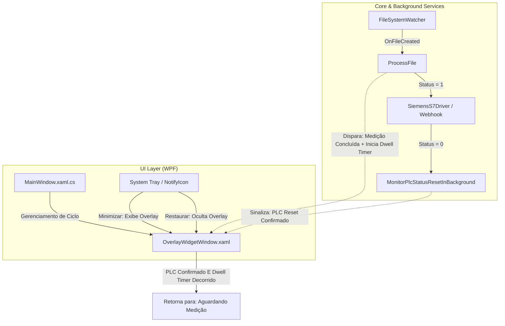

# Implementation Plan: Fase 5 - Widget Overlay HUD (Versão 1.3.0)

Este documento estabelece o projeto de arquitetura, análise de impacto e o roteiro detalhado de implementação para a nova funcionalidade **Widget Overlay (HUD)** do ConnectML, projetado para a versão **1.3.0**.

> [!IMPORTANT]
> **User Review Required**
> Este plano introduz uma camada visual perimetral contínua na tela para que o operador acompanhe o status dos arquivos e do PLC sem sair do software MeasurLink (em tela cheia):
> 1. **Hit-Testing Crítico**: Para não interferir na operação do MeasurLink, o centro da janela do Overlay utilizará estritamente `Background="{x:Null}"` e a borda perimetral terá `IsHitTestVisible="False"`. Assim, todos os cliques do mouse passam direto para o MeasurLink.
> 2. **Lógica de Transição com Tempo Mínimo (Display Dwell Time)**: A transição de "Medição Concluída" para "Aguardando Medição" requer **duas condições**: que o PLC tenha resetado a variável `Status` para `FALSE` **E** que o tempo mínimo de exibição (padrão de 10s, configurável de 1s a 30s) tenha decorrido, garantindo visualização confortável pelo operador mesmo com resets ultrarrápidos do PLC.
> 3. **Aba Minimalista com Acesso Rápido**: Textos reduzidos apenas ao estado da aplicação e um botão discreto ("Abrir janela principal") para restaurar o ConnectML com um clique.

---

## 🔍 Contexto Operacional e Diagnóstico de Necessidade

1. **Cenário de Chão de Fábrica**:
   - O operador utiliza o software de metrologia (ex: Mitutoyo MeasurLink) em **tela cheia**.
   - O ConnectML opera minimizado em segundo plano na bandeja do sistema (System Tray).
2. **Problema Atual**:
   - Para saber se um arquivo de medição (.QIF / .XML) foi processado e entregue ao PLC com sucesso, o operador precisa alternar janelas (`Alt + Tab`) ou restaurar o ConnectML pelo System Tray, gerando atrito operacional.
3. **Solução Proposta**:
   - Um **Widget Overlay HUD (Heads-Up Display)** transparente e não-intrusivo:
     - **Borda perimetral luminosa**: Monitora o ciclo (Amarelo pulsante = Aguardando Medição; Verde sólido = Medição Concluída).
     - **Aba retrátil (Draggable Dock Tab)**: Cartão minimalista com o status do ciclo e botão de atalho para restaurar o ConnectML, com ancoragem (*Snap*) nos 4 cantos da tela (Topo, Base, Esquerda, Direita).

---

## 🎯 Estratégia Arquitetural e Análise de Impacto



### Análise de Impactos:

| Componente | Nível de Impacto | Descrição e Estratégia de Mitigação |
| :--- | :---: | :--- |
| **Interferência no MeasurLink (Hit-Testing)** | Crítico | Em WPF, `Background="Transparent"` captura cliques do mouse. A janela DEVE usar `Background="{x:Null}"` e a borda perimetral DEVE ter `IsHitTestVisible="False"`. Apenas a aba do widget responderá a eventos de mouse. |
| **Lógica de Conclusão e Dwell Time** | Médio | Evitar que o estado verde suma antes de o operador enxergar (caso o PLC responda em 100ms) e garantir que não volte para amarelo se o PLC ainda estiver processando. Implementado via controle temporal assíncrono conjugado. |
| **Consumo de CPU/GPU** | Baixo | Utilização de animações nativas em GPU (`Storyboard` com `ColorAnimation` / `DoubleAnimation` no Composition Target), mantendo o uso de CPU abaixo de 0.5% em repouso. |
| **Múltiplos Monitores e Resoluções** | Médio | Posicionamento automático respeitando o `SystemParameters.WorkArea` da tela principal / ativa. |
| **Persistência de Dados** | Baixo | Adicionar propriedades tipadas em `AppConfig.cs` (incluindo `OverlayHoldSeconds`) e persistir no `%AppData%\ConnectML\appsettings.json`. |

---

## ⏱️ Mecanismo de Transição de Estado (Handshake + Dwell Timer)

A transição de retorno do estado visual **"Medição Concluída" (Verde Sólido)** para **"Aguardando Medição" (Amarelo Pulsante)** segue a lógica de conjugação estrita:

1. **Disparo da Conclusão:**
   - Ao concluir a escrita das DBs e setar `Status = 1`, o overlay passa imediatamente para **"Medição Concluída"** (Verde Sólido).
   - Inicia-se simultaneamente o cronômetro do **Display Dwell Time** (`OverlayHoldSeconds`, padrão = 10s).
2. **Condição 1 - Resposta do PLC:**
   - A rotina em background `MonitorPlcStatusResetInBackground` detecta quando a DB de Status retorna para `0` (`Status == false`).
3. **Condição 2 - Tempo Mínimo Decorrido:**
   - O tempo de tela decorrido deve ser `>= OverlayHoldSeconds` (ajustável de 1s a 30s).
4. **Comportamento das Condições:**
   - **Se o PLC responder rápido (ex: em 200ms):** O estado **continua Verde** até completar os 10 segundos configurados, garantindo que o operador veja o sucesso da medição.
   - **Se o PLC demorar (ex: 15 segundos):** O estado **continua Verde** além dos 10 segundos. Ele **NUNCA** volta prematuramente para "Aguardando" enquanto o PLC não tiver resetado a variável.
   - **Momento do Retorno:** Apenas quando `(PlcResetCompleted == true) AND (DwellTimerElapsed == true)` o overlay volta suavemente para o estado **"Aguardando Medição"** (Amarelo Pulsante).

---

## 🚀 Divisão de Ações em Sprints

```text
feature/widget-overlay
│
├── Sprint 5.1: Setup, Versionamento e Branching (v1.3.0)
├── Sprint 5.2: Infraestrutura XAML e Hit-Testing do Overlay
├── Sprint 5.3: UX, Animações Storyboard, Snap e Botão Restaurar
├── Sprint 5.4: Integração de Ciclo de Vida, FileWatcher e Dwell Timer
└── Sprint 5.5: Validação Prática, Profiling e Pacote Velopack
```

---

### Sprint 5.1: Setup, Versionamento e Branching (v1.3.0)
- **Objetivo**: Isolar o desenvolvimento em uma branch Git dedicada e promover a versão da aplicação de `1.2.1` para `1.3.0`.
- **Ações e Comandos**:
  ```bash
  git checkout -b feature/widget-overlay
  ```
  - **`[MODIFY]`** `ConnectML.UI.csproj`: Atualizar `<Version>1.3.0</Version>`.
  - **`[MODIFY]`** `Program.cs`: Atualizar busca da janela no Mutex para `"ConnectML - V1.3.0"`.
  - **`[MODIFY]`** `MainWindow.xaml`: Atualizar `Title="ConnectML - V1.3.0"` e texto no rodapé para `"Versão 1.3.0"`.
  - **`[MODIFY]`** `AppConfig.cs`: Adicionar propriedades de configuração:
    ```csharp
    public bool EnableOverlayWidget { get; set; } = true;
    public int OverlayBorderThickness { get; set; } = 3;
    public string OverlaySnapPosition { get; set; } = "Top"; // "Top", "Bottom", "Left", "Right"
    public int OverlayHoldSeconds { get; set; } = 10; // Faixa: 1 a 30 segundos (padrão = 10)
    ```

---

### Sprint 5.2: Infraestrutura XAML e Hit-Testing do Overlay
- **Objetivo**: Criar a janela `OverlayWidgetWindow` maximizada e transparente, garantindo que nenhum clique seja capturado na área central.
- **Ações**:
  - **`[NEW]`** `ConnectML.UI/OverlayWidgetWindow.xaml` e `.xaml.cs`:
    - Propriedades: `WindowStyle="None"`, `AllowsTransparency="True"`, `Topmost="True"`, `ShowInTaskbar="False"`, `Background="{x:Null}"`, `Focusable="False"`.
    - Borda perimetral (`Border x:Name="OverlayBorder"`) com `IsHitTestVisible="False"`.
    - Elemento visual da aba (`Border x:Name="OverlayTab"`) com `IsHitTestVisible="True"`.
  - **Validação de Hit-Testing**: Confirmar que janelas subjacentes continuam clicáveis sem nenhuma perda de foco ou interferência.

---

### Sprint 5.3: UX, Animações Storyboard, Snap e Botão Restaurar
- **Objetivo**: Implementar a máquina de estados visuais minimalista, o botão "Abrir janela principal" e a lógica de arrasto com ancoragem nos 4 lados.
- **Ações**:
  - **Layout da Aba Minimalista**:
    - Texto principal de estado: `"Aguardando Medição"` (quando ocioso) ou `"Medição Concluída"` (quando processado).
    - Botão discreto com ícone elegante e tooltip `"Abrir janela principal"` que dispara evento/comando para restaurar a `MainWindow`.
  - **Storyboards de Animação em XAML**:
    - `PulseAnimation`: Animação cíclica de `BorderBrush` e `Opacity` entre `#F59E0B` e `#FDE68A` (baixo uso de CPU).
    - `SuccessTransition`: Transição imediata para `#10B981` (Verde Sólido).
  - **Mecânica de Snap (Drag & Drop)**:
    - Eventos `MouseLeftButtonDown`, `MouseMove`, `MouseLeftButtonUp` com `CaptureMouse()`.
    - Algoritmo de proximidade calculando a borda mais próxima (`Top`, `Bottom`, `Left`, `Right`) e executando `DoubleAnimation` suave até o encaixe.
    - Adaptação dinâmica de orientação (horizontal para Top/Bottom; vertical compacto para Left/Right).

---

### Sprint 5.4: Integração de Ciclo de Vida, FileWatcher e Dwell Timer
- **Objetivo**: Orquestrar a exibição do Overlay com os eventos de minimização/restauração, transições de arquivos e controle do timer conjugado.
- **Ações**:
  - **`[MODIFY]`** `MainWindow.xaml.cs`:
    - Instanciar `OverlayWidgetWindow` e subscrever ao evento de clique do botão "Abrir janela principal" chamando `RestoreWindow()`.
    - Ao executar `BtnMinimize_Click` (ou ao iniciar minimizado pelo Windows): se `EnableOverlayWidget == true` e o serviço estiver rodando, chamar `_overlayWindow.Show()`.
    - Em `RestoreWindow()`: chamar `_overlayWindow.Hide()`.
    - Em `StopService()` e `OnClosed()`: garantir o fechamento/descarte do overlay.
  - **Integração de Estado com Dwell Timer Conjugado**:
    - Ao concluir o despacho do arquivo: aciona `_overlayWindow.SetCompletedState()`.
    - Inicia cronômetro do tempo configurado (`OverlayHoldSeconds`).
    - Quando o reset do PLC ocorre (`MonitorPlcStatusResetInBackground`): sinaliza que o PLC concluiu.
    - Quando ambas as condições se cumprem: aciona `_overlayWindow.SetWaitingState()`.
  - **`[MODIFY]`** `MainWindow.xaml`:
    - Na aba de Configurações, adicionar controles:
      - CheckBox: "Exibir Widget Overlay ao Minimizar".
      - Slider / Campo numérico: "Espessura da Borda (1px a 8px)".
      - Slider / Campo numérico: "Tempo de Exibição de Sucesso (1s a 30s, padrão: 10s)".

---

### Sprint 5.5: Validação Prática, Profiling e Pacote Velopack
- **Objetivo**: Validar a ergonomia de chão de fábrica, certificar consumo de CPU/GPU e gerar release via Velopack.
- **Ações**:
  - Profiling de uso de hardware (assegurar consumo de CPU < 0.5% em repouso).
  - Testes com o MeasurLink aberto em tela cheia (validar que botões de medição continuam 100% clicáveis).
  - Teste da mecânica de Dwell Time:
    - Teste 1: PLC reseta rápido (200ms) -> Tela continua verde até 10s.
    - Teste 2: PLC demora 15s -> Tela continua verde até os 15s e só volta quando o PLC resetar.
  - Empacotamento de teste via `vpk pack` para v1.3.0.

---

## 🧪 Critérios de Aceite e Matriz de Testes

| Item de Teste | Critério de Sucesso | Método de Validação |
| :--- | :--- | :--- |
| **Passagem de Cliques (Hit-Test)** | Todos os cliques fora da aba passam 100% para o MeasurLink. | Clicar em botões e menus do MeasurLink com o Overlay ativo. |
| **Animação "Aguardando"** | Borda perimetral pulsa suavemente em amarelo com CPU < 0.5%. | Inspecionar Task Manager / Resource Monitor. |
| **Animação "Concluído"** | Borda torna-se verde sólido imediatamente após a escrita no PLC. | Injetar arquivo .QIF de medição. |
| **Dwell Time Conjugado** | Permanece verde pelo tempo mínimo (ex: 10s) E só volta se PLC = 0. | Testar cenários de reset rápido e reset lento do PLC. |
| **Configuração de Tempo** | Slider permite ajustar dwell time entre 1s e 30s. | Ajustar na UI e verificar persistência no `appsettings.json`. |
| **Botão Abrir Principal** | Clique no botão da aba restaura a janela do ConnectML instantaneamente. | Clicar no botão da aba no Overlay. |
| **Snap nos 4 Cantos** | Aba fixa no Topo, Base, Esquerda ou Direita conforme o arrasto. | Arrastar e soltar nos 4 quadrantes da tela. |
| **Ciclo de Vida** | Aparece ao minimizar para o Tray; oculta ao restaurar o ConnectML. | Minimizar e restaurar a janela repetidas vezes. |
