# ConnectML - Plano de Execução das Sprints: Fase 6 (Versão 1.3.1)
**Detalhamento Técnico das Sprints de Desenvolvimento: Monitoramento e Transporte do Leitor de Código de Barras com Automação de Teclado no MeasurLink**

Este documento detalha passo a passo as tarefas de desenvolvimento, arquivos afetados, contratos de código e critérios de aceite para cada uma das Sprints da **Fase 6 (v1.3.1)**, em complemento ao plano arquitetural [ip-p6_barcode-serial-monitor.md](file:///c:/Antigravity/ConnectML/docs/implementations/v1.3.1/ip-p6_barcode-serial-monitor.md).

---

## 🗺️ Mapa de Execução das Sprints

```mermaid
gantt
    title Roteiro de Execução - Fase 6 (Leitor de Código de Barras & Automação MeasurLink)
    dateFormat  X
    axisFormat %s
    section Sprint 6.1
    Branching, Bump v1.3.1 & Config JSON Extensível   :done, s1, 0, 1
    section Sprint 6.2
    Core, Foco Win32 & Simulador Teclas MeasurLink    :done, s2, 1, 2
    section Sprint 6.3
    UI Utilidades, Regras & Carga Dinâmica de Comandos:done, s3, 2, 3
    section Sprint 6.4
    Ciclo de Vida, Concorrência & Logs Objetivos       :done, s4, 3, 4
    section Sprint 6.5
    Validação com0com, Teste Alt+Q+O & Documentação   :done, s5, 4, 5
```



---

## 🚀 Sprint 6.1: Setup, Branch Git, Versionamento Global e Modelo JSON Extensível

### 🎯 Objetivo
Criar a branch dedicada `feature/barcode-serial-monitor`, promover a versão de toda a solução para `1.3.1` e estender o modelo de dados de configuração `AppConfig` para suportar as portas seriais, a lista de regras de palavras-chave e o catálogo extensível de comandos carregados a partir do `appsettings.json`.

### 📋 Tarefas Técnicas

#### 1. Criação da Branch Git
- **Comando:**
  ```bash
  git checkout -b feature/barcode-serial-monitor
  ```

#### 2. Bump de Versão Global (1.3.0 -> 1.3.1)
- **`ConnectML.Core/ConnectML.Core.csproj`**:
  ```xml
  <Version>1.3.1</Version>
  ```
- **`ConnectML.Infrastructure/ConnectML.Infrastructure.csproj`**:
  ```xml
  <Version>1.3.1</Version>
  ```
- **`ConnectML.Simulator/ConnectML.Simulator.csproj`**:
  ```xml
  <Version>1.3.1</Version>
  ```
- **`ConnectML.UI/ConnectML.UI.csproj`**:
  ```xml
  <Version>1.3.1</Version>
  ```
- **`ConnectML.UI/Program.cs`**:
  ```csharp
  IntPtr hWnd = FindWindow(null, "ConnectML - V1.3.1");
  ```
- **`ConnectML.UI/MainWindow.xaml`**:
  ```xml
  Title="ConnectML - V1.3.1"
  ```
  e no rodapé do painel de logs:
  ```xml
  <TextBlock Text="Versão 1.3.1" FontSize="10" Foreground="{StaticResource TextSecondary}" VerticalAlignment="Center"/>
  ```

#### 3. Extensão do Modelo de Configuração (`AppConfig.cs`)
- **`ConnectML.UI/Models/AppConfig.cs`**:
  ```csharp
  // Leitor de Código de Barras (v1.3.1)
  public bool BarcodeReaderEnabled { get; set; } = false;
  public string BarcodeReaderPort { get; set; } = string.Empty;
  public string BarcodeOutputPort { get; set; } = string.Empty;
  public List<ConnectML.Core.Models.BarcodeRuleConfig> BarcodeRules { get; set; } = new List<ConnectML.Core.Models.BarcodeRuleConfig>();

  // Catálogo de Comandos customizável via appsettings.json
  public List<ConnectML.Core.Models.BarcodeCommandDefinition> BarcodeCommands { get; set; } = new List<ConnectML.Core.Models.BarcodeCommandDefinition>
  {
      new ConnectML.Core.Models.BarcodeCommandDefinition
      {
          Id = "undo",
          Name = "Desfazer (Alt + Q + O)",
          KeySequence = "%{q}{o}", // Sintaxe de atalhos
          TargetWindowTitle = "MeasurLink",
          PreDelayMs = 80
      }
  };
  ```

### ✅ Critérios de Sucesso
1. Compilação limpa da solução via `dotnet build ConnectML.sln` com 0 erros.
2. Executável e assemblies reportando versão `1.3.1`.
3. Serialização e desserialização de `AppConfig` com persistência correta dos campos e comandos no `%AppData%\ConnectML\appsettings.json`.

---

## ⚙️ Sprint 6.2: Arquitetura Core, Foco Win32 e Automação de Teclado no MeasurLink

### 🎯 Objetivo
Implementar os contratos de domínio, modelos de dados, o helper Win32 de foco de janela, o executor de simulação de teclas e o serviço de monitoramento serial que intercepta as palavras-chave e aciona o MeasurLink.

### 📋 Tarefas Técnicas

#### 1. Criação dos Modelos e Contratos no Core (`ConnectML.Core`)
- **`ConnectML.Core/Models/BarcodeRuleConfig.cs`**:
  ```csharp
  namespace ConnectML.Core.Models
  {
      public class BarcodeRuleConfig
      {
          public string Keyword { get; set; } = string.Empty;
          public string CommandId { get; set; } = string.Empty;
      }
  }
  ```
- **`ConnectML.Core/Models/BarcodeCommandDefinition.cs`**:
  ```csharp
  namespace ConnectML.Core.Models
  {
      public class BarcodeCommandDefinition
      {
          public string Id { get; set; } = string.Empty;
          public string Name { get; set; } = string.Empty;
          public string KeySequence { get; set; } = string.Empty;
          public string TargetWindowTitle { get; set; } = "MeasurLink";
          public int PreDelayMs { get; set; } = 80;
      }
  }
  ```
- **`ConnectML.Core/Interfaces/IBarcodeCommandHandler.cs`**:
  ```csharp
  namespace ConnectML.Core.Interfaces
  {
      public interface IBarcodeCommandHandler
      {
          Task<bool> ExecuteCommandAsync(string commandId, string keyword);
          IReadOnlyList<Models.BarcodeCommandDefinition> GetAvailableCommands();
          void ReloadCommands(IEnumerable<Models.BarcodeCommandDefinition> commands);
      }
  }
  ```
- **`ConnectML.Core/Interfaces/IBarcodeMonitorService.cs`**:
  ```csharp
  namespace ConnectML.Core.Interfaces
  {
      public interface IBarcodeMonitorService : IDisposable
      {
          bool IsRunning { get; }
          Task StartMonitoringAsync(string readerPort, string outputPort, IEnumerable<Models.BarcodeRuleConfig> rules, CancellationToken cancellationToken = default);
          Task StopMonitoringAsync();
          void UpdateRules(IEnumerable<Models.BarcodeRuleConfig> rules);
          event EventHandler<Models.BarcodeTransportResult>? ReadingProcessed;
      }
  }
  ```

#### 2. Helper Win32 de Localização e Foco de Janela (`WindowFocusHelper.cs`)
- **`ConnectML.Infrastructure/Win32/WindowFocusHelper.cs`**:
  - Implementa P/Invoke para Win32:
    - `EnumWindows` com callback para varredura de janelas de nível superior.
    - `GetWindowText` e `GetWindowTextLength` para leitura do título da janela.
    - Busca case-insensitive por correspondência parcial (ex: janela contendo `"MeasurLink"`).
    - Tratamento de janela minimizada: `IsIconic(hWnd)` -> `ShowWindow(hWnd, SW_RESTORE)`.
    - `SetForegroundWindow(hWnd)` associado a `AttachThreadInput` para garantir transferência efetiva do foco do teclado no Windows.

#### 3. Implementação do Simulador de Teclas (`MeasurLinkKeyboardCommandHandler.cs`)
- **`ConnectML.Infrastructure/Commands/MeasurLinkKeyboardCommandHandler.cs`**:
  - Implementa `IBarcodeCommandHandler`.
  - Mantém catálogo de `BarcodeCommandDefinition` (inicializado pelo `AppConfig` via JSON).
  - Execução da rotina:
    1. Localiza a definição do comando pelo `commandId`.
    2. Invoca `WindowFocusHelper.FindAndFocusWindow(cmd.TargetWindowTitle)`.
    3. Se janela não for encontrada: emite `Log.Warning("[Leitor] Falha: Janela contendo '{Title}' não encontrada.", cmd.TargetWindowTitle)` e retorna falso.
    4. Se encontrada: aguarda `cmd.PreDelayMs` (ex: 80ms) para estabilização de foco.
    5. Dispara a simulação de teclas (ex: `SendKeys.SendWait("%qo")` ou sequência Win32 `keybd_event`/`SendInput` para `Alt + Q + O`).
    6. Emite `Log.Information("[Leitor] Palavra-chave '{Keyword}' interceptada -> Comando '{Command}' ({Keys}) executado no MeasurLink [Sucesso]", keyword, cmd.Name, cmd.KeySequence)`.

#### 4. Implementação do Monitor Serial (`BarcodeSerialMonitorService.cs`)
- **`ConnectML.Infrastructure/Services/BarcodeSerialMonitorService.cs`**:
  - Gerenciamento de duas portas seriais: entrada (leitor) e saída (MeasurLink via com0com).
  - Bufferização assíncrona por delimitador de linha (`\r`, `\n` ou `\r\n`).
  - Lógica de decisão:
    - Se a leitura bate com alguma `Keyword`: **intercepta**, não transmite para a saída, e despacha para `_commandHandler.ExecuteCommandAsync(...)`.
    - Se não bate com nenhuma palavra-chave: transmite os dados com terminador para a porta COM de saída (MeasurLink) e registra log de sucesso.

### ✅ Critérios de Sucesso
1. Compilação bem-sucedida de `ConnectML.Core` e `ConnectML.Infrastructure`.
2. Teste funcional do `WindowFocusHelper`: encontra janelas abertas por título parcial (ex: "MeasurLink" ou "Bloco de notas") e traz para primeiro plano.
3. Teste de simulação de teclas: confirmação de envio da combinação `Alt + Q + O` para a janela focada.

---

## 🎨 Sprint 6.3: Interface do Usuário (UI) - Seção Utilidades e Regras Dinâmicas

### 🎯 Objetivo
Criar a nova seção visual **"Utilidades"** na tela principal (`MainWindow.xaml`), com a subseção **"Leitor de Código de Barras"**, comboboxes de portas COM, subpainel dinâmico de palavras-chave/comandos preenchido dinamicamente a partir das definições do JSON e toggle button de ligar/desligar comunicação.

### 📋 Tarefas Técnicas

#### 1. Implementação no XAML (`ConnectML.UI/MainWindow.xaml`)
- Posicionamento: Imediatamente abaixo do Card 3 ("Integração"), antes do espaçador inferior do ScrollViewer.
- Estrutura Visual:
  ```xml
  <!-- CARD 4: UTILIDADES -->
  <Border Style="{StaticResource CardStyle}" Margin="0,12,0,0">
      <StackPanel>
          <!-- Cabeçalho Expansível -->
          <Border BorderBrush="{StaticResource BorderDark}" BorderThickness="0,0,0,1">
              <Button x:Name="BtnToggleUtilities" Click="BtnToggleUtilities_Click" Style="{StaticResource DarkExpanderButtonStyle}" Padding="20,5" Height="40">
                  <Grid>
                      <StackPanel Orientation="Horizontal" HorizontalAlignment="Left">
                          <Viewbox Width="24" Height="24" Margin="0,0,8,0">
                              <Path Fill="{StaticResource PurpleColor}" Stretch="Fill" Data="M22.7,19l-9.1-9.1c0.9-2.3,0.4-5-1.5-6.9C9.8,0.7,6.4,0.4,4,2.3L8,6.3L6.3,8L2.3,4C0.4,6.4,0.7,9.8,3,12.1 c1.9,1.9,4.6,2.4,6.9,1.5l9.1,9.1c0.4,0.4,1,0.4,1.4,0l2.3-2.3C23.1,20,23.1,19.4,22.7,19z"/>
                          </Viewbox>
                          <TextBlock Text="Utilidades" FontSize="18" FontWeight="Bold" VerticalAlignment="Center" Foreground="{StaticResource TextPrimary}"/>
                      </StackPanel>
                      <StackPanel Orientation="Horizontal" HorizontalAlignment="Right">
                          <Path x:Name="IconToggleUtilities" Fill="{StaticResource TextSecondary}" Data="M7,10L12,15L17,10H7Z" Stretch="Uniform" Width="12" Height="12" VerticalAlignment="Center" RenderTransformOrigin="0.5,0.5">
                              <Path.RenderTransform>
                                  <RotateTransform Angle="0"/>
                              </Path.RenderTransform>
                          </Path>
                      </StackPanel>
                  </Grid>
              </Button>
          </Border>

          <!-- Corpo da Seção Utilidades -->
          <StackPanel x:Name="PnlUtilitiesBody" Margin="24,12">
              
              <!-- Subseção: Leitor de Código de Barras -->
              <Grid Margin="0,0,0,12">
                  <StackPanel Orientation="Horizontal" VerticalAlignment="Center">
                      <Viewbox Width="18" Height="18" Margin="0,0,8,0">
                          <Path Fill="#38bdf8" Stretch="Uniform" Data="M2,4H4V16H2V4M5,4H6V16H5V4M7,4H9V16H7V4M10,4H12V16H10V4M13,4H14V16H13V4M16,4H18V16H16V4M19,4H20V16H19V4M21,4H22V16H21V4Z"/>
                      </Viewbox>
                      <TextBlock Text="Leitor de Código de Barras" FontSize="14" FontWeight="Medium" Foreground="#cbd5e1" VerticalAlignment="Center"/>
                  </StackPanel>

                  <!-- Toggle Button de Ativação -->
                  <ToggleButton x:Name="ToggleBarcodeReader" HorizontalAlignment="Right" Click="ToggleBarcodeReader_Click"
                                Cursor="Hand" Width="44" Height="24" Style="{StaticResource SwitchToggleStyle}"/>
              </Grid>

              <!-- Portas COM: Entrada (Leitor) e Saída (MeasurLink) -->
              <Grid Margin="0,0,0,16">
                  <Grid.ColumnDefinitions>
                      <ColumnDefinition Width="*"/>
                      <ColumnDefinition Width="16"/>
                      <ColumnDefinition Width="*"/>
                  </Grid.ColumnDefinitions>

                  <StackPanel Grid.Column="0">
                      <TextBlock Text="Porta Serial do Leitor (Entrada)" FontSize="12" Foreground="{StaticResource TextSecondary}" Margin="0,0,0,4"/>
                      <ComboBox x:Name="CmbBarcodeReaderPort" Height="30" DropDownOpened="CmbBarcodePort_DropDownOpened"/>
                  </StackPanel>

                  <StackPanel Grid.Column="2">
                      <TextBlock Text="Porta Serial de Saída (MeasurLink)" FontSize="12" Foreground="{StaticResource TextSecondary}" Margin="0,0,0,4"/>
                      <ComboBox x:Name="CmbBarcodeOutputPort" Height="30" DropDownOpened="CmbBarcodePort_DropDownOpened"/>
                  </StackPanel>
              </Grid>

              <!-- Subpainel Dinâmico: Palavras-chave e Comandos (Mesmo estilo de Campos de dados) -->
              <Grid Margin="0,0,0,8">
                  <TextBlock Text="Palavras-chave e Comandos de Ação" FontSize="12" Foreground="{StaticResource TextSecondary}" VerticalAlignment="Center"/>
                  <Button x:Name="BtnAddBarcodeRule" Click="BtnAddBarcodeRule_Click" Width="30" Height="30" HorizontalAlignment="Right" Style="{StaticResource RoundedButtonStyle}" ToolTip="Adicionar Palavra-chave e Comando">
                      <Viewbox Width="12" Height="12">
                          <Path Fill="{StaticResource TextSecondary}" Data="M19,13H13V19H11V13H5V11H11V5H13V11H19V13Z" Stretch="Uniform"/>
                      </Viewbox>
                  </Button>
              </Grid>

              <!-- Lista Dinâmica de Regras -->
              <ItemsControl x:Name="ItemsBarcodeRules">
                  <ItemsControl.ItemTemplate>
                      <DataTemplate>
                          <Grid Margin="0,6">
                              <Grid.ColumnDefinitions>
                                  <ColumnDefinition Width="1.2*"/>
                                  <ColumnDefinition Width="12"/>
                                  <ColumnDefinition Width="1.8*"/>
                                  <ColumnDefinition Width="Auto"/>
                              </Grid.ColumnDefinitions>

                              <!-- Campo Palavra-chave -->
                              <TextBox Grid.Column="0" Text="{Binding Keyword, Mode=TwoWay, UpdateSourceTrigger=PropertyChanged}" 
                                       Height="30" VerticalAlignment="Center" ToolTip="Palavra-chave a ser interceptada"/>

                              <!-- Combobox Comando (Alimentado dinamicamente pelos Comandos do JSON) -->
                              <ComboBox Grid.Column="2" 
                                        SelectedValue="{Binding CommandId, Mode=TwoWay}"
                                        SelectedValuePath="Id"
                                        DisplayMemberPath="Name"
                                        ItemsSource="{Binding DataContext.AvailableBarcodeCommands, RelativeSource={RelativeSource AncestorType=Window}}"
                                        Height="30" VerticalAlignment="Center"/>

                              <!-- Botão Remover -->
                              <Button Grid.Column="3" Click="BtnRemoveBarcodeRule_Click" Width="30" Height="30" Margin="8,0,0,0" 
                                      Style="{StaticResource RoundedButtonStyle}" Background="{StaticResource StopRedBg}" 
                                      Foreground="{StaticResource StopRed}" BorderBrush="{StaticResource StopRedBorder}" 
                                      BorderThickness="1" VerticalAlignment="Center" ToolTip="Remover Regra">
                                  <Viewbox Width="12" Height="12">
                                      <Path Fill="{StaticResource StopRed}" Data="M19,13H5V11H19V13Z" Stretch="Uniform"/>
                                  </Viewbox>
                              </Button>
                          </Grid>
                      </DataTemplate>
                  </ItemsControl.ItemTemplate>
              </ItemsControl>

          </StackPanel>
      </StackPanel>
  </Border>
  ```

#### 2. Code-Behind (`ConnectML.UI/MainWindow.xaml.cs`)
- Classe observável `BarcodeRuleItem : INotifyPropertyChanged`:
  - `Keyword`: string com notificação.
  - `CommandId`: string com notificação.
- Propriedade observável de comandos disponíveis:
  ```csharp
  public ObservableCollection<BarcodeCommandDefinition> AvailableBarcodeCommands { get; } = new ObservableCollection<BarcodeCommandDefinition>();
  ```
- Coleção de regras ativas:
  ```csharp
  private ObservableCollection<BarcodeRuleItem> _barcodeRules = new ObservableCollection<BarcodeRuleItem>();
  ```
- Ao carregar as configurações (`LoadSettings`):
  - Alimenta `AvailableBarcodeCommands` com a lista vinda de `AppConfig.BarcodeCommands` (que contém `"undo"` por padrão ou itens adicionados manualmente via JSON).
  - Alimenta `_barcodeRules` com os pares palavra-chave/comando salvos.
- Handlers:
  - `BtnToggleUtilities_Click`: Expande/colapsa com rotação do chevron.
  - `BtnAddBarcodeRule_Click`: Adiciona uma nova regra com palavra-chave vazia e o primeiro comando disponível selecionado.
  - `BtnRemoveBarcodeRule_Click`: Remove a regra da coleção.
  - `PopulateBarcodeComPorts()`: Preenche as portas COM existentes no sistema via `SerialPort.GetPortNames()`.

### ✅ Critérios de Sucesso
1. A seção "Utilidades" é exibida logo abaixo de "Integração" com visual Dark Industrial coeso.
2. Cada nova linha criada no leitor exibe a combobox de comandos populada automaticamente com os itens configurados no JSON (iniciando com "Desfazer (Alt + Q + O)").
3. Novos comandos inseridos manualmente no `appsettings.json` aparecem na ComboBox do ConnectML ao abrir a aplicação.

---

## ⚡ Sprint 6.4: Integração de Ciclo de Vida, Não-Bloqueio e Logging Objetivo

### 🎯 Objetivo
Conectar o serviço de monitoramento serial ao ciclo de vida da aplicação (`StartService` / `StopService`), permitir alternância em runtime pelo Toggle Button do leitor e assegurar que logs objetivos sejam gravados no arquivo do Serilog e exibidos na aba visual LOG.

### 📋 Tarefas Técnicas

#### 1. Integração no Ciclo de Vida do Middleware (`MainWindow.xaml.cs`)
- Injeção e inicialização de `IBarcodeMonitorService` e `IBarcodeCommandHandler`:
  ```csharp
  private IBarcodeMonitorService? _barcodeMonitorService;
  private IBarcodeCommandHandler? _barcodeCommandHandler;
  private CancellationTokenSource? _barcodeCts;
  ```
- No método `StartService()`:
  - Se `ToggleBarcodeReader.IsChecked == true` e as portas de entrada e saída estiverem preenchidas:
    - Inicializa `_barcodeCts = new CancellationTokenSource()`.
    - Dispara em `Task.Run` o `StartMonitoringAsync` passando as portas e a lista de regras ativas.
- No método `StopService()`:
  - Se o serviço do leitor estiver rodando, cancela cooperativamente e aguarda o fechamento limpo das portas COM.
- No evento `ToggleBarcodeReader_Click`:
  - Se a aplicação estiver em execução (`_isRunning`), inicia ou encerra o monitoramento serial dinamicamente, permitindo ligar/desligar o leitor sem reiniciar a esteira de arquivos QIF.

#### 2. Padronização de Logs Objetivos
- Mensagens padronizadas no Serilog:
  - Ao transportar com sucesso:
    `Log.Information("[Leitor] Leitura transportada para {Port}: '{Data}' [Sucesso]", outputPort, data);`
  - Ao interceptar palavra-chave e executar comando:
    `Log.Information("[Leitor] Palavra-chave '{Keyword}' interceptada -> Comando '{Command}' ({Keys}) executado no MeasurLink [Sucesso]", keyword, cmd.Name, cmd.KeySequence);`
  - Ao falhar na localização da janela:
    `Log.Warning("[Leitor] Palavra-chave '{Keyword}' interceptada -> Janela '{Window}' não encontrada para execução do comando.", keyword, cmd.TargetWindowTitle);`
  - Ao ocorrer erro de I/O na serial:
    `Log.Error("[Leitor] Falha na comunicação serial ({Port}): {Message}", port, ex.Message);`
- Exibição em tempo real na aba visual LOG via sink nativo do Serilog sem código de UI adicional.

### ✅ Critérios de Sucesso
1. Início e parada do leitor sincronizados com o botão Iniciar/Parar e com o toggle individual.
2. Zero contenção de thread: a esteira QIF e a interface gráfica permanecem responsivas mesmo durante a execução de comandos de teclado e transporte serial contínuo.
3. Logs concisos e objetivos visíveis na aba LOG e gravados no arquivo rotativo.

---

## 🧪 Sprint 6.5: Validação com com0com, Testes de Foco/Teclas e Atualização Documental

### 🎯 Objetivo
Validar a solução ponta a ponta com portas virtuais `com0com`, testar a automação de foco e pressionamento de teclas `Alt + Q + O`, testar a adição de comandos customizados no JSON, atualizar a documentação da versão `1.3.1` e preparar o PR.

### 📋 Tarefas Técnicas

#### 1. Procedimento de Testes Práticos
1. **Configuração com0com**:
   - Par virtual: `COM10` (Entrada do Leitor) e `COM11` (Saída para o MeasurLink).
2. **Cenário 1: Transporte Transparente**:
   - Transmitir `"LOT-2026-X\r\n"` na COM10.
   - Confirmar recepção na COM11.
   - Confirmar log objetivo de transporte bem-sucedido.
3. **Cenário 2: Intercepção de Palavra-chave e Comando Desfazer**:
   - Abrir o MeasurLink (ou janela de teste contendo "MeasurLink" no título).
   - Cadastrar regra: Palavra-chave `"DESFAZER"` -> Comando `"Desfazer (Alt + Q + O)"`.
   - Transmitir `"DESFAZER\r\n"` na COM10.
   - Confirmar que a COM11 **não** recebe dados.
   - Confirmar que a janela do MeasurLink ganha foco e recebe o atalho `Alt + Q + O`.
   - Confirmar log objetivo de comando executado.
4. **Cenário 3: Adição de Comando Customizado via `appsettings.json`**:
   - Adicionar novo comando no JSON:
     ```json
     {
       "Id": "confirm",
       "Name": "Confirmar (Enter)",
       "KeySequence": "{ENTER}",
       "TargetWindowTitle": "MeasurLink"
     }
     ```
   - Reabrir a aplicação e verificar se "Confirmar (Enter)" aparece na combobox de comandos.
5. **Cenário 4: Resiliência e Concorrência**:
   - Enviar arquivos QIF de teste na pasta monitorada enquanto leituras normais e de comando chegam via serial.
   - Confirmar que ambas as operações ocorrem em paralelo sem travamento.

#### 2. Atualização da Documentação
- **`docs/ARCHITECTURE.md`**: Atualizar com a nova Seção de Leitor de Código de Barras, automação Win32 e extensão por JSON.
- **`docs/AI_CODEBASE_MAP.md`**: Adicionar novos componentes (`WindowFocusHelper`, `MeasurLinkKeyboardCommandHandler`, `BarcodeSerialMonitorService`, `BarcodeCommandDefinition`).
- **`README.md`**: Adicionar resumo da versão 1.3.1.

### ✅ Critérios de Sucesso
1. Todos os 4 cenários de teste aprovados sem inconformidades.
2. Documentação e mapa da base de código 100% atualizados para a versão 1.3.1.
3. Código pronto para merge com commit semântico.
